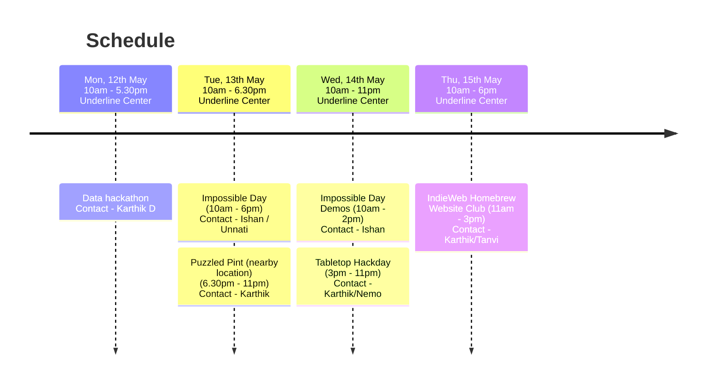

Recurse-ish community in Bangalore's celebration of Recurse Center's [Never Graduate Week](https://www.recurse.com/about#never-graduate) from May 12-16, 2025.

## Propose a talk/session

This schedule is community-driven, so please consider proposing a talk/session/hackday idea by creating a pull request with a file in the `/schedule` folder [by clicking here](https://github.com/karthikb351/recurse-ngw-2025/new/main/schedule?filename=session.md&value=What%20is%20your%20session%20about%3F)

# Who are we?
We are a group of tech and tech-adjacent enthusiasts, many of whom are alumni of [Recurse Center](https://recurse.com). We meet every Tuesday to co-work together as part of the [Recursive Coworking Meetup](https://captnemo.in/cowork/).

# Events

## Data Hackathon (Karthik D)

Hack on data-first projects. Build data visualizations, release a new dataset, or do data-wizardry in general.

## Impossible Day (Ishan / Unnati)

Take a project that you think is impossibly hard. Push yourselves a little bit, on a short timeframe (1 day) and see how far you get.

## [Puzzled Pint](./schedule/puzzledpint.md)

Puzzled Pint is a casual, social puzzle solving event which happens at bars/pubs on the second Tuesday of every month in multiple cities around the world. 

## [Tabletop Hackday (Karthik / Nemo)](./schedule/tabletop-hackday.md)

Hack on the intersection of boardgames and computing. Write a bot, simulate a game, write a solver, or analyse a game. We hosted an earlier version of this event at https://underline.center/t/tabletop-hackday-with-nemo-and-karthik/239

## IndieWeb Homebrew Website Club (Karthik / Tanvi)

Join the indieweb - hack on your own website. https://indieweb.org/

> The IndieWeb is a people-focused alternative to the “corporate web”. 

# Code of Conduct

Please note that all NGW events will be under the [Recurse Center Code of Conduct](https://www.recurse.com/code-of-conduct). For any reports, please contact Karthik or Nemo. For attendees, please go through the [Recurse Center Social Rules](https://www.recurse.com/social-rules). The below is a short summary of the Social Rules. Please read through the link and follow them.

> **No well-actually’s**
>
> Alice: I just installed Linux on my computer!
> 
> Bob: It’s actually called GNU/Linux.
> 
> A well-actually is when you correct someone about something that’s not relevant to the conversation or tangential to what they’re trying to say.
>
> **No feigning surprise**
> 
> Dan: What’s the command line?
> 
> Carol: Wait, you’ve never used the command line?
> 
> Feigned surprise is when you act surprised when someone doesn’t know something. Responding with surprise in this situation makes people feel bad for not knowing things and less likely to ask questions in the future, which makes it harder for them to learn.
>
> **No backseat driving**
> Bob: What’s the name of the string copy function?
> Alice: Strncpy.
> Eve: (from across the room) You should use strlcpy. It’s safer.
> Backseat driving is when you lob advice from across the room (or across the online chat) without really joining or engaging in a conversation.
>
> **No subtle -isms**
> Carol: Windows is hard to use.
> Bob: No way. Windows is so easy to use that even my mom can use it.
> Subtle -isms are small things that make others feel unwelcome, things that we all sometimes do by mistake. Subtle -isms make people feel like they don’t belong. There’s another part of no subtle -isms: all discussions of -isms and politics at NGW should be opt-in, like in a one-on-one conversation, or in a clearly described event in a private room.
