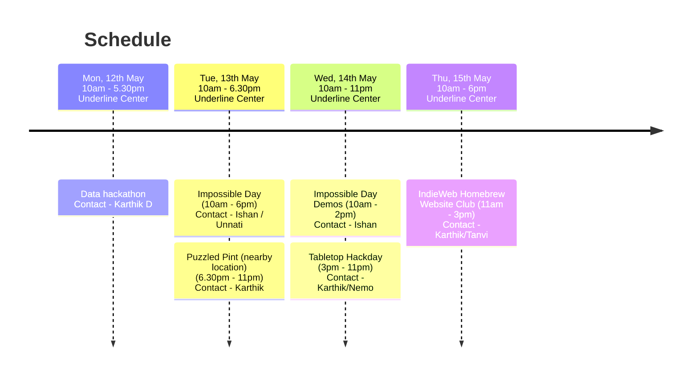

Recurse-ish community in Bangalore's celebration of Recurse Center's [Never Graduate Week](https://www.recurse.com/about#never-graduate) from May 12-16, 2025.

## Propose a talk/session

This schedule is community-driven, so please consider proposing a talk/session/hackday idea by creating a pull request with a file in [`/schedule`](https://github.com/karthikb351/recurse-ngw-2025/new/main/schedule)

# Who are we?
We are a group of tech and tech-adjacent enthusiasts, many of whom are alumni of [Recurse Center](https://recurse.com). We meet every Tuesday to co-work together as part of the [Recursive Coworking Meetup](https://captnemo.in/cowork/).
